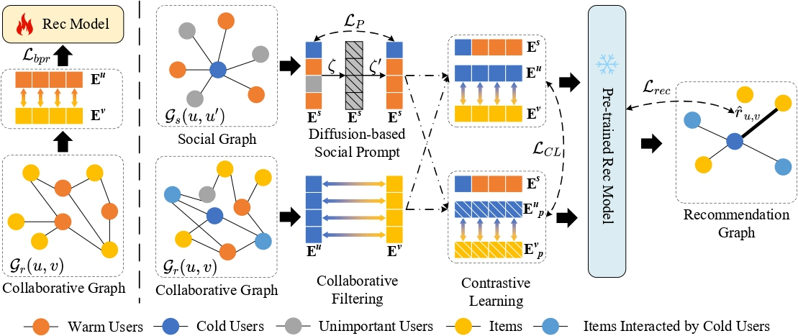

<div align="center">
  <h1>SCL4Rec: Diffusion Model based Social Prompt Learning for User Cold-start Recommendations</h1>
</div>



## Environment Requirements

```txt
python==3.8
torch==1.11.0
numpy==1.23.1
scipy==1.9.1
dgl==1.0.2+cu113
```

### dgl installation help

#### 1. pip

`pip install dgl==1.0.2 -f https://data.dgl.ai/wheels/cu113/repo.html`

#### 2. wheel

`https://data.dgl.ai/wheels/cuXX/repo.html`

XX refers to cuda version
